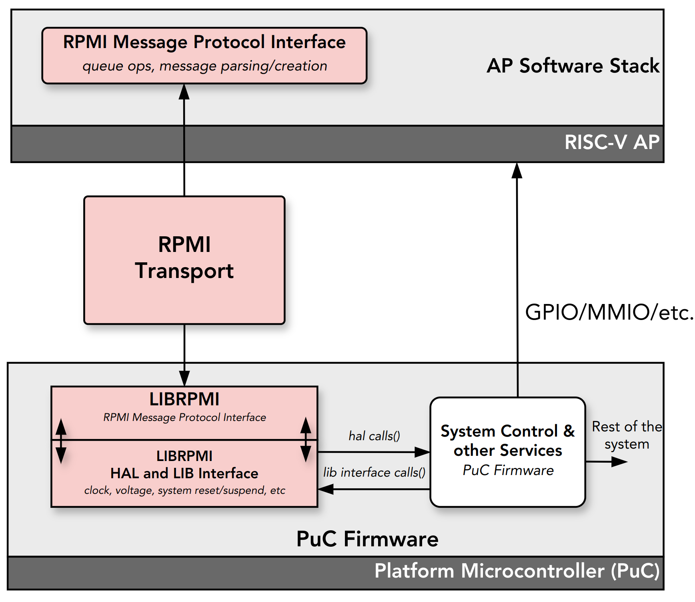

## librpmi - RPMI Protocol Implementation

## Introduction
The librpmi is an implementation of [RISC-V Platform Management Interface](https://github.com/riscv-non-isa/riscv-rpmi).

The librpmi implements RPMI shared memory transport, RPMI message protocol and
various Service groups and Services as defined in the RPMI specification.



The librpmi can be used by - 
1. RISC-V platform vendors to implement RPMI services in their
platform microcontroller firmware.

2. System-level partitions to implement RPMI services running as
separate OpenSBI domain

3. Hypervisors/emulators/simulators to emulate RPMI services for the Guest/VM

### Features
- RPMI Transport (shared memory)
	- Multiple RPMI shared memory based transports capability.
	- Configurable transport where service groups can be enabled or disabled
    for specific transport (except Base group).
- RPMI Service Groups
  - [x] Base
  - [x] System Reset
  - [x] System Suspend
  - [x] Hart State Management
  - [x] Clock
  - [x] CPPC
 - Platform HAL interface.
 - Test framework to test librpmi which is easy to extend and add more service
 group test cases.
 - HTML and PDF documentation generated by doxygen.

> The librpmi is a new project and is in development. More capabilities and
service groups will be added soon.

## Development
The librpmi supports GNU Make and comes with a simple Makefile generates
`librpmi.a` under `build` directory and test applications in `build\test`
directory.

### librpmi.a
```
// defaut without debug logs and tests, compiler optimizations are on
make

// Enable debug logs and build tests, compiler optimizations are off
make LIBRPMI_TEST=y LIBRPMI_DEBUG=y

// Cross compilation
make CROSS_COMPILE=<compiler prefix>
```
The platform vendors may also integrate librpmi sources directly into the
platform microcontroller firmware and extend firmware build system to
build the librpmi sources rather than using `librpmi.a`.

## Documentation
The librpmi supports doxygen which can generate both html and pdf
documentation under `build\docs` directory.
```
make docs
```

This generates pdf file `build/docs/latex/refman.pdf` and html documentation
at `build/docs/html`.

## Test
Build test binaries -
```
make LIBRPMI_TEST=y
```
Refer: [README in test folder](test/README.md)


## License

The librpmi is provided under [2-Clause BSD License](COPYING.BSD)
