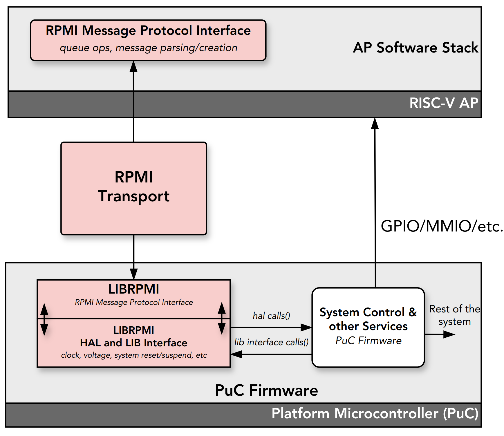

## librpmi - RPMI Protocol Implementation

## Introduction
The librpmi is an implementation of [RISC-V Platform Management Interface](https://github.com/riscv-non-isa/riscv-rpmi).

The librpmi implements RPMI shared memory transport, RPMI message protocol and
various Service groups and Services as defined in the RPMI specification.



The librpmi can be used by - 
1. RISC-V platform vendors to implement RPMI services in their
platform microcontroller firmware.

2. System-level partitions to implement RPMI services running as
separate OpenSBI domain

3. Hypervisors/emulators/simulators to emulate RPMI services for the Guest/VM

### Features

- **RPMI Transport Layer**
  - Shared memory-based transport implementation
  - Support for multiple concurrent RPMI transport instances
  - Per-transport service group configuration (Base group always enabled)

- **RPMI Service Groups**
  - Supports RPMI v1.0 (Ratified) and v2.0 (Draft) service groups
  - See [COMPLIANCE.md](COMPLIANCE.md) for complete implementation and test coverage status

- **Platform Integration**
  - Clean HAL (Hardware Abstraction Layer) interface for platform-specific operations
  - Minimal platform dependencies for easy porting

- **Testing & Documentation**
  - Extensible test framework for service group validation
  - Comprehensive API documentation (HTML and PDF via Doxygen)

## Development
The librpmi supports GNU Make and comes with a simple Makefile that generates
`librpmi.a`, shared library objects (`librpmi.so.*`), and test applications
under the `build` directory.

### librpmi.a and shared library objects
```
// defaut without debug logs and tests, compiler optimizations are on
make

// Enable debug logs and build tests, compiler optimizations are off
make LIBRPMI_TEST=y LIBRPMI_DEBUG=y

// Cross compilation
make CROSS_COMPILE=<compiler prefix>
```
By default, `make` generates:
- `build/librpmi.a`
- `build/librpmi.so.<major>.<minor>.<patch>`
- symlinks `build/librpmi.so.<soversion>` and `build/librpmi.so`

The platform vendors may also integrate librpmi sources directly into the
platform microcontroller firmware and extend firmware build system to
build the librpmi sources rather than using `librpmi.a`.

## Packaging
The repository can build Debian and RPM packages for systems that want to
consume librpmi as an installed library instead of integrating the source tree
or manually copying build artifacts. These packages provide a repeatable way to
install the runtime library, development files, and source content needed by
downstream projects such as emulators, hypervisors, firmware build flows, and
distribution packaging pipelines.

Debian packages can be built with:
```shell
make deb-pkg
```

This stages the Debian packaging from `packaging/debian` and writes the package
outputs under `build/deb`. The generated packages are:
- `librpmi0`: runtime shared library (`librpmi.so.*`).
- `librpmi-dev`: headers, static library, linker symlink, and `pkg-config`
  metadata for building applications against librpmi.
- `librpmi-src`: source content installed under `/usr/src/librpmi` for users
  that need to inspect or rebuild the library sources.

Install the generated Debian packages with:
```shell
sudo dpkg -i build/deb/librpmi0_*.deb \
             build/deb/librpmi-dev_*.deb \
             build/deb/librpmi-src_*.deb
```

RPM packages can be built with:
```shell
make rpm-pkg
```

This uses `packaging/rpm/librpmi.spec` and writes the RPM build tree under
`build/rpmbuild`. The generated RPM packages are:
- `librpmi`: runtime shared library (`librpmi.so.*`).
- `librpmi-devel`: headers, static library, linker symlink, and `pkg-config`
  metadata for building applications against librpmi.
- `librpmi-source`: source content installed under `/usr/src/librpmi`.

Install the generated RPM packages with the system package manager, for example:
```shell
sudo dnf install build/rpmbuild/RPMS/*/*.rpm
```

## Documentation
The librpmi supports doxygen which can generate both html and pdf
documentation under `build\docs` directory.
```
make docs
```

This generates pdf file `build/docs/latex/refman.pdf` and html documentation
at `build/docs/html`.

## Test
Build test binaries -
```shell
make LIBRPMI_TEST=y
```
Run tests -
```shell
make check
```
Refer: [README in test folder](test/README.md)

## Project process

- [Contributing guide](CONTRIBUTING.md)
- [Maintainers](MAINTAINERS.md)
- [Release process](RELEASE.md)

## License

The librpmi is provided under [2-Clause BSD License](COPYING.BSD)
